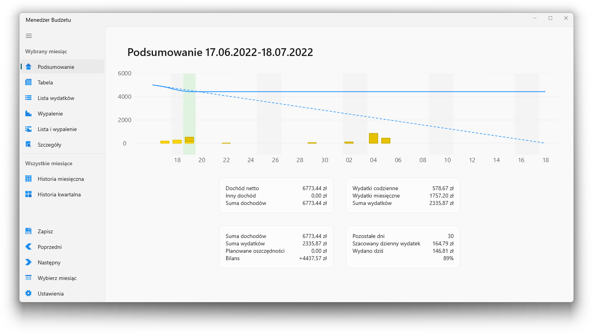
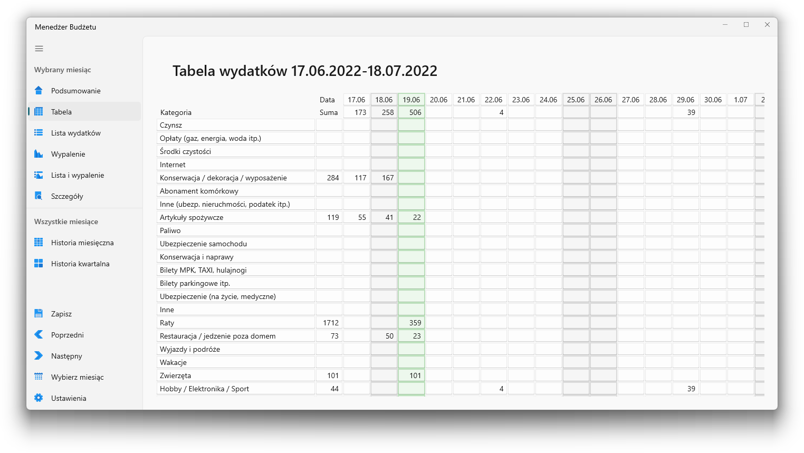
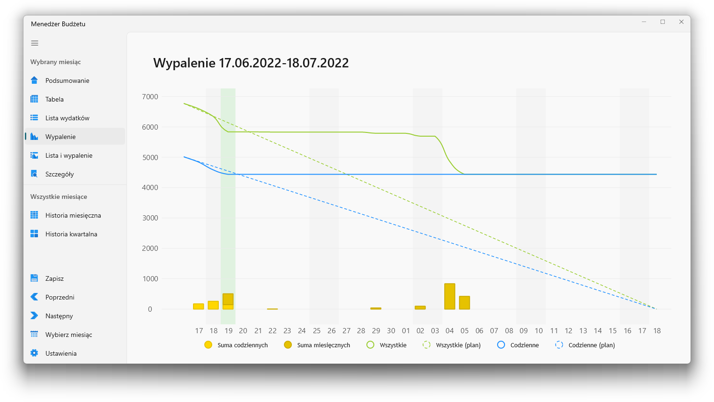
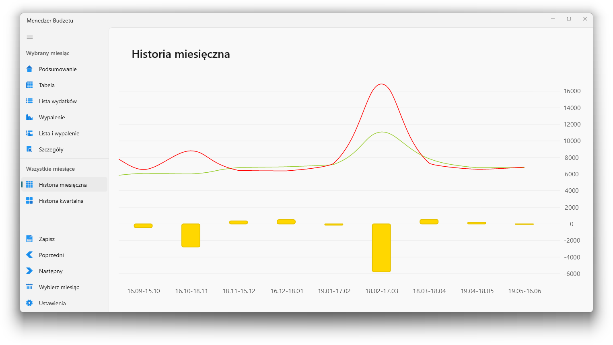
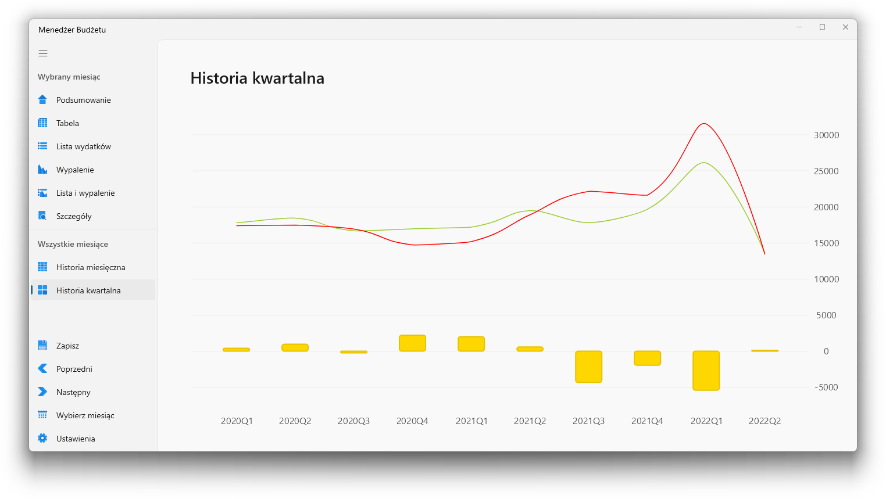

# Budget Manager

Aplikacja umożliwiająca zapisywanie codziennych wydatków i wyświetlanie statystyk.

## Funkcje

- Kontrola wykorzystania planowanego miesięcznego budżetu
- Dodawanie wydatków w danej kategorii
- Oznaczanie wydatków jako wydatki stałe
- Ustalanie dochodu netto i dochodu dodatkowego
- Ustalanie planowanych oszczędności w miesiącu
- Wyświetlanie szacowanego dziennego limitu wydatków
- Przegląd statystyk miesięcznych i kwartalnych

## TODO

- Skróty klawiszowe
- Ustawienia
  - zmiana ścieżki do danych
- Wypalenie:
  - szacowany dzienny wydatek na każdy dzień
- RadioChart per kategorie (lub x największych i pozostałe)
- Raport
- Cofnij/powtórz wykonaną operację
- Sortowanie / zmiana kolejności kategorii
- Najczęściej używane kategorie na górze listy rozwijanej
- Porządkowanie danych
  - W przypadku daty spoza zakresu przenoszenie wydatków do właściwego okresu rozliczeniowego
    - Jeśli okresu brak, pytanie o zmianę daty lub usunięcie
  - Usuwanie nieużywanych kategorii

